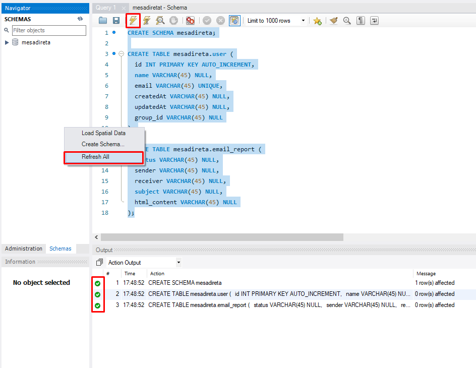
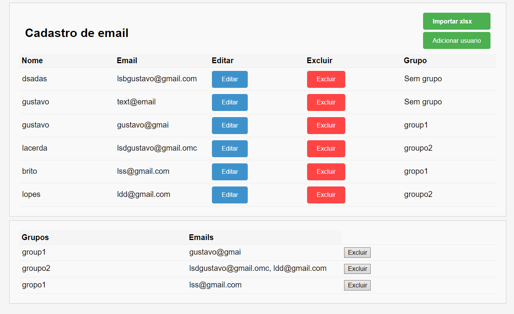

# Mesa Direta Node

O código Node.js para mesa direta é projetado para facilitar a conexão com um serviço de envio de e-mails e um banco de dados SQL. Seu propósito é permitir o cadastro de e-mails e grupos de e-mails de clientes, possibilitando a criação de e-mails automatizados com a inclusão de arquivos e palavras dinâmicas. Além disso, proporciona a funcionalidade de visualizar um relatório abrangente sobre e-mails enviados ou não enviados. O sistema também oferece a capacidade de importar e-mails através de arquivos no formato XLSX.

Se possível, leia este README no meu GitHub [gustavolace/mesa-direta-node](https://github.com/gustavolace/mesa-direta-node/blob/main/README.md)

## Índice
- [Instalação](#instalação)
  - [Banco de dados SQL](#mysql)
  - [Serviço de SMTP](#smtp)
  - [Login](#login)
  - [Variáveis de ambiente (.env)](#env)
- [Uso](#uso)
  - [Login](#login-site)
  - [Cadastro de Clientes](#cadastro-de-clientes)
  - [Clientes XLSX](#clientes-xlsx)
  - [Grupos](#grupos)
  - [Edição/Exclusão](#ediçãoexclusão)
  - [E-mails](#envio-de-e-mails)
  - [Corpo do E-mail](#corpo-do-e-mail)
- [Créditos](#créditos)

## Instalação

O código já é compilado com o Node e está no arquivo executável. As únicas dependências são as configurações com os serviços listados abaixo.

### MySQL

Para configurar o banco de dados onde serão armazenadas as informações do cliente, será necessária a instalação do MySQL Workbench juntamente com o MySQL Server.

Após a instalação e configuração de um usuário novo, é hora de configurar um novo servidor. Um servidor localhost será suficiente para este código. Clique no "+" para configurar uma nova conexão e preencha as opções do seu servidor.

Esta é a configuração padrão para localhost. Clique em "Test Connection" para verificar se está funcionando e, em seguida, em "OK" para confirmar.

Dentro do servidor, criaremos um novo SCHEMA e as respectivas tabelas. Copie o código do [script.sql](./script.sql), cole no campo de consulta do MySQL Workbench, selecione todo o texto e clique no ícone de raio para executar.

Após a execução, aparecerá um "v" de confirmação em "Action Output". Clique na parte vazia do campo, use "Refresh All" e observe que um novo schema foi criado com os campos informados, como exemplificado pela imagem abaixo.

### SMTP

A configuração de SMTP é exigida para o preenchimento das variáveis de ambiente. Ela é utilizada para o envio de e-mails. Recomendo a criação de um novo e-mail para o teste deste código. Os de uso mais simples são [Outlook](https://www.microsoft.com/pt-br/microsoft-365/outlook/email-and-calendar-software-microsoft-outlook) ou [AWS SES](https://aws.amazon.com/pt/ses/).

As informações necessárias são um host, uma porta, uma configuração de segurança (0 para false, 1 para true), o e-mail, a senha e um e-mail de exibição (pode ser o mesmo do e-mail).

Em minha configuração da AWS, fica desta forma:

No Outlook, substitua 0 por 1 e o mailhost pelo mail host da Microsoft "smtp-mail.outlook.com". Em PASS e USER, coloque seu e-mail e sua senha normalmente.

### Login

A configuração de login apenas cadastra um usuário e senha para acesso ao site do código. Como questão de segurança, escolha um usuário e senha para registrar. Escreveremos na próxima sessão.

### .env

Agora, em variáveis de ambiente, todas as configurações serão efetivamente colocadas em funcionamento. Acesse o arquivo [.env](./.env) e preencha com as informações que criamos nos passos anteriores.

## Uso

Abaixo estarão algumas instruções de como usar o código corretamente. Antes de tudo, para dar início, abra o arquivo executável compatível com seu sistema operacional e verifique as logs de funcionamento. No Windows, fica desta maneira.

 

Após isso, copie "http://localhost:3333/start" e cole no seu navegador. Você será redirecionado para uma tela de configuração.

### Login Site

Na tela de login, preencha com as informações de SIGN_USER e SIGN_PASS, clique em entrar para usufruir do sistema.

### Cadastro de clientes

Existem duas formas de cadastrar clientes, um por vez ou por importação.

Para cadastro de usuário único, clique em "Adicionar Usuário".

Dentro do modal que aparecerá, você pode preencher as informações, sendo nome e e-mail obrigatórios e únicos, por cliente e grupo opcional.

Se um grupo for colocado no cadastro, isso criará um novo grupo exibido na lista inferior. Todos os usuários que tiverem grupos escritos da mesma maneira (incluindo minúsculas e maiúsculas) estarão no mesmo grupo.

### Clientes XLSX

Para fazer importação por XLSX, será necessária a criação de uma tabela em um software externo de criação de tabelas.

A primeira linha da tabela será o cabeçalho, onde devem ser definidas que informações do cliente estarão na coluna da seguinte maneira e ordem.

Lembre-se de que não podem haver e-mails repetidos, senão nenhum dos e-mails será cadastrado! Os usuários que tiverem group_id(s) iguais na tabela irão pertencer ao mesmo grupo.

Após salvar o arquivo em formato XLSX, importe-o por meio do botão "Importar XLSX".

### Grupos

Os grupos são formados quando usuários têm group_id(s) iguais, como já explicado acima. No formulário de grupo, é possível excluir um grupo, mas isso excluirá todos os usuários que pertencem a ele.

### Edição/Exclusão

No formulário de edição, todos os campos são opcionais. Preencha apenas os que deseja alterar, e os outros campos permanecerão iguais como eram antes.

No botão de exclusão, aperte para excluir um usuário, confirme o alerta, e ele será excluído.

### Envio de e-mails

Para selecionar os e-mails aos quais você deseja enviar e-mails, aperte em "Selecionar Opções" e selecione a opção que desejar. Uma prévia do e-mail que será enviado aparecerá no canto direito.

### Corpo do e-mail

O corpo do e-mail é feito e enviado em formato HTML, então, se houver conhecimento, podem ser usadas tags como `<h1>`, `<a>`, mas em geral, o campo de adição comum é o suficiente. A prévia mostra como ficará quando enviado.

É possível utilizar palavras dinâmicas para o envio. A palavra especial `$client`, quando escrita, é enviada contendo o nome dos clientes, tanto no corpo quanto no assunto.

## Créditos

Código composto por Gustavo Lacerda como projeto da Infinity School.

E que tal tentar enviar um e-mail? Teste comigo! 
Contato <a href="lsbgustavo@gmail.com">lsbgustavo@gmail.com</a>
